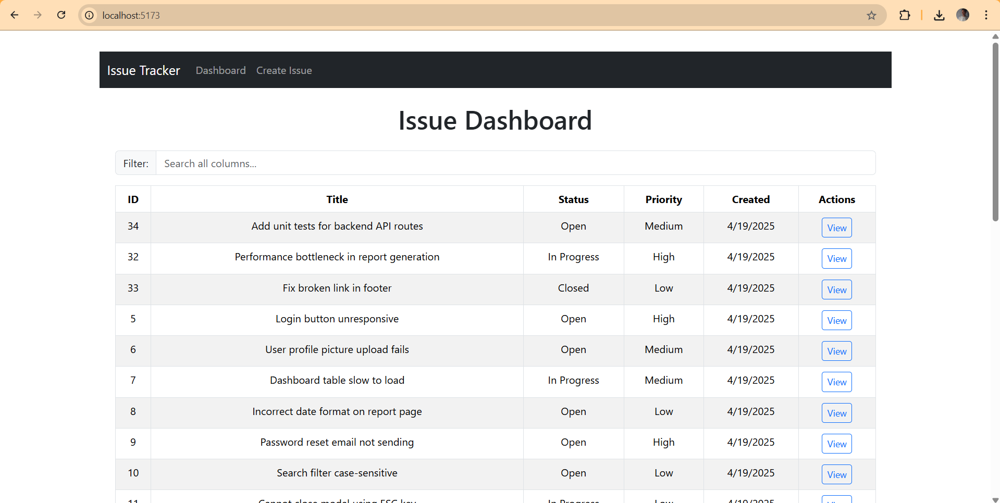
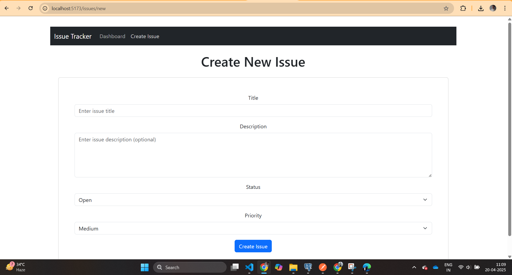
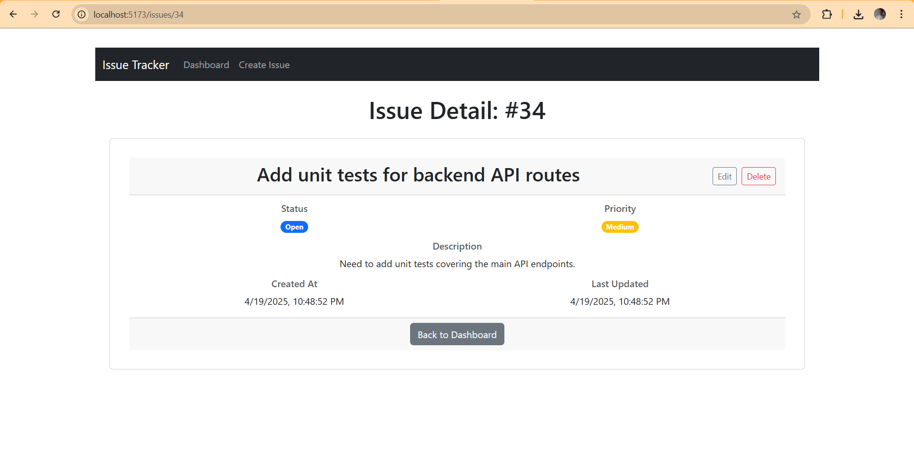
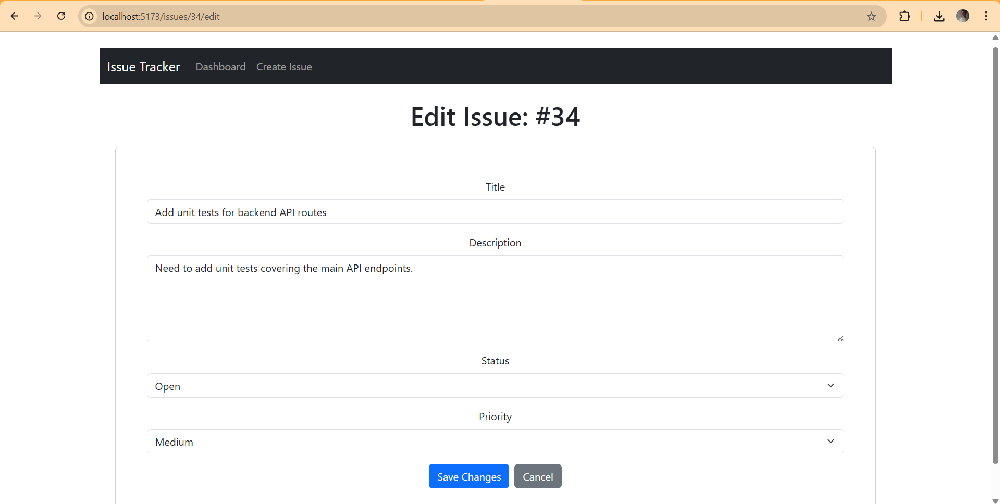
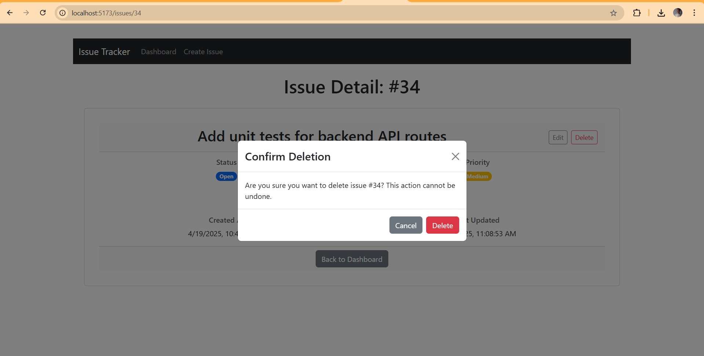
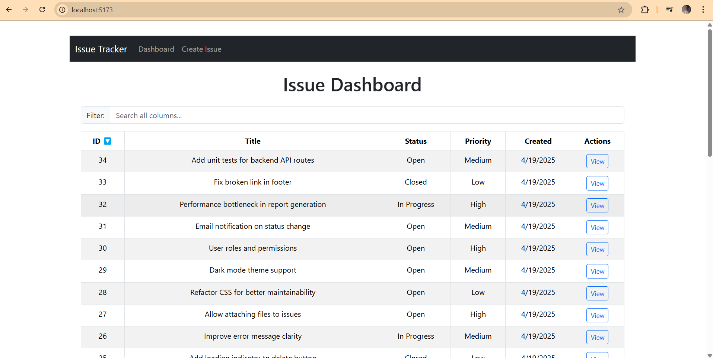
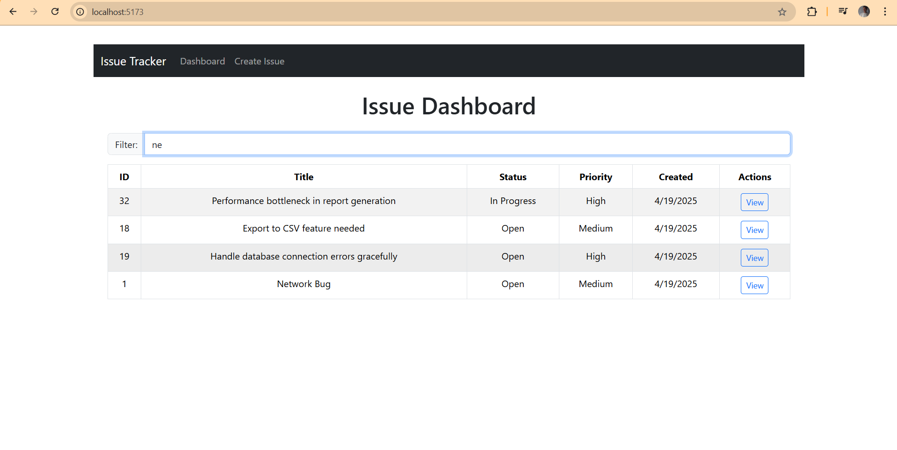

# Issue Tracker Application

A full-stack web application for managing software issues or bugs, featuring Create, Read, Update, and Delete (CRUD) operations.

## Description

This application provides a user interface to view a list of issues, see detailed information for a specific issue, create new issues, and edit or delete existing ones. The goal is to offer a simple yet effective tool for tracking project tasks or software bugs.


## Tech Stack

**Frontend:**

* React.js (v19+)
* React Router DOM (v6)
* Axios (for API calls)
* React Bootstrap & Bootstrap (for UI components and styling)
* React Hook Form (for form management)
* react-bootstrap/Modal (for confirmation dialogs)
* Vite (for frontend tooling)
* @tanstack/react-table (for sortable/filterable table)

**Backend:**

* Node.js
* Express.js
* PostgreSQL (with `pg` driver)
* `express-validator` (for input validation)
* `morgan` (for HTTP request logging)
* `cors` (for Cross-Origin Resource Sharing)
* `dotenv` (for environment variables)
* `nodemon` (for development auto-restart)

**Development:**

* `concurrently` (to run frontend and backend simultaneously)

## Getting Started

Follow these instructions to get a copy of the project up and running on your local machine for development and testing purposes.

### Prerequisites

Ensure the following software is installed on your system:

* Node.js (v18 or later recommended)
* npm (usually comes with Node.js)
* Git
* PostgreSQL Server (running locally or accessible)

### Installation

1.  **Clone the repository:**
    ```bash
    git clone <https://github.com/06Gagan/issue-tracker-app.git>
    cd issue-tracker-app
    ```

2.  **Install dependencies:**
    Run the following command from the root project directory (`issue-tracker-app/`) to install dependencies for the root, client, and server projects:
    ```bash
    npm run install:all
    ```
    *(Alternatively, navigate into the `client` and `server` directories individually and run `npm install` in each, plus `npm install` in the root directory).*

3.  **Set up Backend Environment Variables:**
    * Navigate to the `server` directory (`cd server`).
    * Create a file named `.env`. A common way is to copy an example file if one exists (`cp .env.example .env`), otherwise create it manually.
    * Edit the `.env` file and add your specific PostgreSQL database connection details:
        ```env
        # server/.env
        DB_USER=your_postgres_user
        DB_HOST=localhost
        DB_DATABASE=your_issue_tracker_db_name
        DB_PASSWORD=your_postgres_password
        DB_PORT=5432
        PORT=5001 # Port the backend server will run on
        ```

4.  **Set up PostgreSQL Database:**
    * Ensure the PostgreSQL server is running.
    * Connect to PostgreSQL (using `psql`, `pgAdmin`, or another GUI tool).
    * Create the database specified in the `.env` file (e.g., `CREATE DATABASE your_issue_tracker_db_name;`).
    * Connect to the newly created database (e.g., `\c your_issue_tracker_db_name`).
    * Run the following SQL script to create the necessary `issues` table and related objects:
        ```sql
        -- Creates the main table for storing issues
        CREATE TABLE issues (
            id SERIAL PRIMARY KEY,
            title VARCHAR(255) NOT NULL,
            description TEXT,
            status VARCHAR(50) DEFAULT 'Open' CHECK (status IN ('Open', 'In Progress', 'Closed')),
            priority VARCHAR(50) DEFAULT 'Medium' CHECK (priority IN ('Low', 'Medium', 'High')),
            created_at TIMESTAMP WITH TIME ZONE DEFAULT CURRENT_TIMESTAMP,
            updated_at TIMESTAMP WITH TIME ZONE DEFAULT CURRENT_TIMESTAMP
        );

        -- Optional: Creates a function to automatically update the updated_at timestamp
        CREATE OR REPLACE FUNCTION update_updated_at_column()
        RETURNS TRIGGER AS $$
        BEGIN
           NEW.updated_at = NOW();
           RETURN NEW;
        END;
        $$ language 'plpgsql';

        -- Optional: Creates a trigger to execute the function before any update on the issues table
        CREATE TRIGGER update_issues_updated_at
        BEFORE UPDATE ON issues
        FOR EACH ROW
        EXECUTE FUNCTION update_updated_at_column();
        ```
        *(Note: If the table or functions already exist from previous setup, running `CREATE` commands might result in "already exists" errors, which can be ignored if the setup is already complete).*

### Running the Application

1.  **Start Development Servers:**
    From the **root** project directory (`issue-tracker-app/`), run the following command in a single terminal:
    ```bash
    npm run dev
    ```
    This uses `concurrently` to start both the backend (`nodemon`) and frontend (`vite`) development servers.

2.  **Access the application:**
    * The backend API server will run on `http://localhost:5001` (or the `PORT` specified in `server/.env`).
    * The frontend React application will be available at `http://localhost:5173` (or the default port used by Vite). Open this URL in your browser.

## Screenshots

**Dashboard View:**


**Create Issue Form:**


**Issue Detail View:**


**Edit Issue Form:**


**Delete Confirmation:**


**Dashboard - Sorting Active:**


**Dashboard - Filtering Active:**
